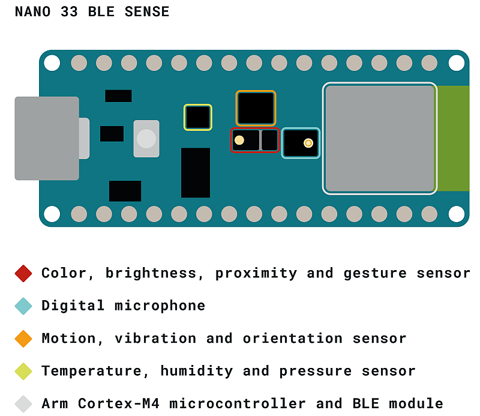
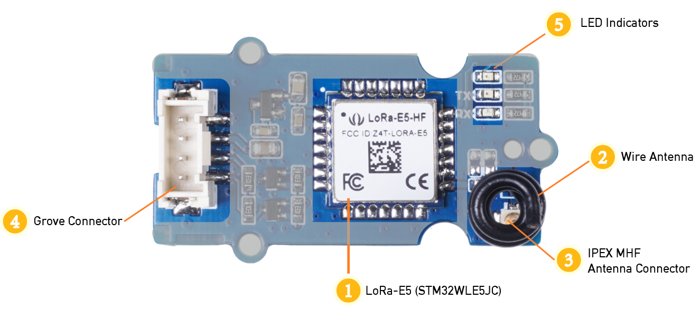
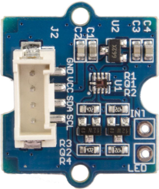
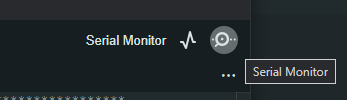
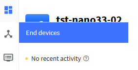
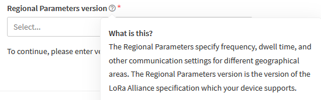
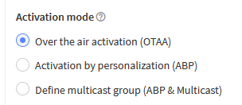
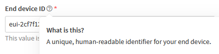
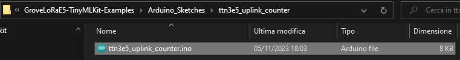
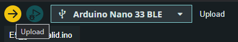

# Connecting an End-Node to the LoraWan TTN Network

[TOC]

## What is a LoraWan end device?

A LoRaWAN end device is an IoT device that uses LoRaWAN technology to communicate over long distances with low power consumption.

From a hardware point of view, end devices are made up of several key components that can vary according to the application and the needs of the IoT device, however we can identify the presence of these essential parts:

1. **Microcontroller**: This is a low power consumption unit that manages sensor data collection, processing and communication. It is often an element that integrates various communication interfaces and/or sensors to minimize external wiring, simplify data acquisition and the development process of IoT applications.

2. **LoRa Module**: An essential component for LoRaWAN communication, often designed to minimize power consumption. It includes the LoRa radio transmitter and receiver, which allow the node to send and receive data on the LoRa radio frequency.

3. **Antenna**: An antenna is required for the transition from the  guided wave  in the transceiver to the unguided way in the air. The antenna is used for both transmission and reception.

4. **Sensors**: End nodes are often equipped with one or more sensors for collecting environmental data or other information. Depending on the application, these sensors can include temperature, humidity, pressure sensors, accelerometers, light sensors, etc.,.

The end device of our project consists of these modules:

1. **Arduino Nano 33 Ble Sense Microcontroller**: This element also integrates sensors such as accelerometer, gyroscope, magnetometer, humidity sensor, temperature sensor, etc.

   

2. **Grove LoRa E5**: A module designed to enable long-distance communication through LoRa technology.

   

   - Support LoRaWAN protocol on EU868/US915 frequency band
   - Ultra-long transmitting range up to 10km
   - Easy control by AT command via UART connection
   - Rapid prototyping with plug-and-play Grove interfaces
   - Ultra-low power consumption and high performance

3. **TML Grove carrier board**: This board provides the necessary connectors and interfaces to ensure a secure connection between the Arduino microcontroller and system elements (such as LoRa E5 and Grove sensor boards), simplifying the assembly process with the addition of other components.

   

## Connecting the elements that make up the end-node


This photo illustrates how the various modules that make up the end-node should be connected

In this example, the following have been connected:

- the Arduino Nano 33 BLE Sense microcontroller on the carrier board

- there is a Grove - Sunlight Sensor, connected on the carrier in the I2C connector at the top left

  

  https://wiki.seeedstudio.com/Grove-Sunlight_Sensor/

  

- the Grove LoRa E5 module is plugged into the Grove connector [A6,A7,3V3,GND] on the bottom left

  

On the bottom right, there are also other connectors on the carrier board that can be used to connect Grove Digital I/O cards


## Steps to Perform Node Registration on The Things Network

Once the components of the end device have been assembled, it is necessary to register it on TTN3.

Below I list the various steps, also providing various references on the web that deepen the individual topics:

1. **Read docs and do experiments**: start by reading the documentation, then write little programs to experiment with your node hardware:
   - https://docs.arduino.cc/hardware/nano-33-ble-sense
   - https://wiki-content.arduino.cc/en/Guide/NANO33BLESense
   - https://docs.arduino.cc/software/ide-v2/tutorials/ide-v2-board-manager
2. **Read the AppEUI and DevEUI keys stored in the Lora E5 module**: the factory has normally already pre-registered the keys needed for the registration of the device on TTN3. However, at any time it is possible to proceed with their modification / rewriting. To do this, it is certainly useful to read these documents:
   - https://wiki.seeedstudio.com/Grove_LoRa_E5_New_Version/
   - https://wiki.seeedstudio.com/LoRa-E5_STM32WLE5JC_Module/#1-quick-start-of-at-commands
   - [AT Command Specification_V1.0 .pdf](https://files.seeedstudio.com/products/317990687/res/LoRa-E5%20AT%20Command%20Specification_V1.0%20.pdf)
3. **Log in or create an account on [The Things Network](https://www.thethingsnetwork.org/)**: see these tutorials:
   - https://www.thethingsnetwork.org/docs/
   - https://www.thethingsnetwork.org/docs/quick-start/
4. **Create a new application on the TTN3 platform**:
   - https://www.thethingsindustries.com/docs/integrations/adding-applications/
5. Register the node in the TTN application: Once the new application is created on the TTN, it registers the device within that application. The procedure consists of several steps, including assigning a unique name to the device and entering the AppEUI and DevEUI keys already registered in LoRa E5. At the end, you can generate the AppKEY code, which is needed to configure the TTN access of the LoRa E5 module.
   - https://www.thethingsindustries.com/docs/devices/adding-devices/
   - in https://wiki.seeedstudio.com/LoRa-E5_STM32WLE5JC_Module/#1-quick-start-of-at-commands read the sub-section "1.3 Connect and send data to The Things Network"
   - https://www.thethingsnetwork.org/docs/lorawan/end-device-activation/
6. **Customize software examples**: Customize the examples provided by inserting the correct keys for access to your TTN application. For example, the ttn3e5_uplink_counter.ino source already contains a pre-programmed key used to register a Lora-E5 module in a TTN application developed as an example. To allow your program to connect to the application you registered, you'll need to customize the source by changing the line with the character array "char AppKEY[33]" with the return code when registering the node in your application (a key similar in format to **"0960B8B2A99CA43B2CD981E8948028D8"**)
7. **Upload the firmware to the microcontroller**:
   - https://docs.arduino.cc/software/ide-v2/tutorials/getting-started/ide-v2-uploading-a-sketch
8. **Check the messages returned from the IOT application**:
   - Check the output messages of the LoRa E5 module to make sure it is transmitting and receiving data correctly. This can include verifying sent and received messages.
9. **Check if the node connects to the TTN application**:
   - Log in to your TTN account and see if your device is "active" and sending data successfully. You can use the TTN console to monitor your device's activity.
10. **Through the TTN application, enable other services**:
    - Once the device has been registered and working properly on TTN, you can start using it in your IoT applications. You can also set up integrations with other services or platforms if needed.

In the following sections, the key steps of the entire procedure are developed

## Sketch E5_getserialid.ino: read the keys stored in Lora E5

Open Arduino Ide and select the serial link with 'Arduino Nano 33 BLE'


Open the sketch E5_getserialid.ino\


Run the Upload command


Once the upload is complete, open the serial monitor (top right)



the sketch at regular intervals sends the command "AT+ID" to the LoRa E5 module.

This responds with the stored keys DevAddr, DevEui, AppEui:


```
AT+ID
+ID: DevAddr, 26:0B:C0:C6
+ID: DevEui, 2C:F7:F1:20:42:00:4B:8A
+ID: AppEui, 80:00:00:00:00:00:00:06
```

When configuring an end device device in a LoRaWAN network, the following identifiers are common:

1. **DevEUI (Device EUI)**: The DevEUI, or Device EUI, is a unique identifier assigned to the end device device during production or initial configuration. It is a 64-bit number that serves to uniquely identify the device within the LoRaWAN network. The DevEUI is fixed and does not change during the lifecycle of the device. It is used for identification purposes and is known to both the device and the network.
2. **AppEUI (Application EUI**): The AppEUI, or Application EUI, is another unique 64-bit identifier assigned to the device during setup. The AppEUI is used to identify the application that the device is paired with. The AppEUI is known to both the device and the application. In a LoRaWAN context, the DevEUI and AppEUI are used together to determine the application to which a device will send data.
3. **DevAddr (Device Address)**: The DevAddr, or Device Address, is a 32-bit address assigned to the device during the join phase with the LoRaWAN network. During the Over-The-Air Activation (OTAA) authentication process, the device receives a DevAddr from the network. This address is used to direct the device within the network and to determine the LoRaWAN gateway to send data to. The DevAddr can change when the device reconfigures its connection to the network.

### Sketch E5_getserialid.ino: used to modify DevAddr, DevEui, AppEui keys in LoRa E5 module

You should only use this sketch if you need to change the keys already stored on the device.

To edit, open the E5_setserialid.ino file with Arduino Ide


Go to lines 73 ... 75


Proceed to edit the various elements.

Save the source and proceed with the Upload command

Running the sketch updates the keys with the changed values.

## Create a new TTN application

https://eu1.cloud.thethings.network/console/applications/add


Application ID: **tst-nano33-02**

Application name: **tst-nano33-02**

Press **Create application** button


https://eu1.cloud.thethings.network/console/applications/tst-nano33-02


## Register the node to the TTN application

Press End devices



Open the page

https://eu1.cloud.thethings.network/console/applications/tst-nano33-02/devices


Press **Register end device**


https://eu1.cloud.thethings.network/console/applications/tst-nano33-02/devices/add


Select: **Enter end device specifics manually**


**Set frequency plan**


**Set LoraWAN version**


**Set Regional Parameters version**




Press **Show advanced activation ...**


**Activation mode: choose OTAA**




**Leave these parameters with default values**


### Provide the JoinEUI (AppEui of Lora E5)


Using **E5_getserialid.ino** sketch we have read the keys stored in  LoRa E5. For example, your keys can be similar to these:

```
+ID: DevAddr, 26:0B:36:94
+ID: DevEui, 2C:F7:F1:20:42:00:4B:8A
+ID: AppEui, 80:00:00:00:00:00:00:06
```

In the TTN application page, set the AppEui to the JoinEUI key:

```
AppEui, 80:00:00:00:00:00:00:06
```


Press **Confirm**


Now insert the DevEUI key


```
+
ID: DevEui, 2C:F7:F1:20:42:00:4B:8A
```

**Finally, proceed by generating the AppKey**


Press **Generate**


**Copy the AppKey**

```
3E453E8A2554C6CD0B9EE0ADE50B5082
```

The key must be saved and used subsequently to change the sources of your sketches.

This key will allow your node to connect to the TTN application.

On Next Step, the **End Device ID Code** is automatically generated



```
EUI-2CF7F12042004B8A
```

As the last step, press **Register end device** button


### Warning: this happens if the device has already been registered previously

**TTN does not allow you to re-register the device if it has already been registered, for example in another application.**


If it is not clear which application the device is already registered in, it may be useful to proceed as follows:

1. edit the keys the source of **E5_setserialid.ino** sketch, then upload the sketch to the Arduino micro
2. re-register the device on TTN with the new keys

## Test and Integration of Node on TTN3

At this point, using the **ttn3e5_uplink_counter.ino** sketch we can verify the connection of the node on TTN3.

This sketch every 30 seconds sends the value of a counter to the TTN application.

Open the Arduino Ide and verify that the serial link with '**Arduino Nano 33 BLE**' has been selected


Open the sketch **ttn3e5_uplink_counter.ino**




Within the editor, go to line 127 and change the content of the AppKEY to the content provided by TTN during the node registration phase within the application.


Save the modified code and upload



Upload completed


Proceed by opening the serial terminal


On the serial terminal, messages are displayed about the execution of the various phases of firmware execution

```
+CLASS: A
AT+PORT=8
+PORT: 8
AT+JOIN
+JOIN: Start
+JOIN: NORMAL
+JOIN: Done
...
AT+ID
+ID: DevAddr, 42:00:4B:8A
+ID: DevEui, 2C:F7:F1:20:42:00:4B:8A
+ID: AppEui, 80:00:00:00:00:00:00:06
...
AT
+AT: OK
LoRa E5 configuration
AT+ID
AT+KEY=APPKEY,"0960B8B2A99CA43B2CD981E8948028D8"
+KEY: APPKEY 0960B8B2A99CA43B2CD981E8948028D8
AT+CLASS=A
+CLASS: A
AT+PORT=8
+PORT: 8
AT+JOIN
+JOIN: Start
+JOIN: NORMAL
+JOIN: Network joined
+JOIN: NetID 000013 DevAddr 26:0B:2A:0F
+JOIN: Done
AT+CMSGHEX="00000000"           send counter 0x00
+CMSGHEX: ACK Received
+CMSGHEX: RXWIN2, RSSI -32, SNR 11.0
+CMSGHEX: Done
+CMSGHEX: Start
+CMSGHEX: Wait ACK
Sent uplink msg to TTN3
Wait for 30 seconds ...
...
AT+CMSGHEX="00000003"           send counter 0x03
+CMSGHEX: ACK Received
+CMSGHEX: RXWIN1, RSSI -51, SNR 15.0
+CMSGHEX: Done
+CMSGHEX: Start
+CMSGHEX: Wait ACK
Sent uplink msg to TTN3
Wait for 30 seconds ...

AT+CMSGHEX="00000004"           send counter 0x04
...
```

Open your browser and log in to your account's TTN console

https://eu1.cloud.thethings.network/console/

Select Applications


Select the TTN application where the node was registered

https://eu1.cloud.thethings.network/console/applications/tst-nano33


In the left menu, select End devices

https://eu1.cloud.thethings.network/console/applications/tst-nano33/devices


On the right, you will see the list of devices that have been registered in the application (in this case only one)


By clicking on the row, the device page is displayed

https://eu1.cloud.thethings.network/console/applications/tst-nano33/devices/eui-2cf7f12042004b8a


Press the Live Data tab to view the upload messages sent from the node to the TTN application

https://eu1.cloud.thethings.network/console/applications/tst-nano33/devices/eui-2cf7f12042004b8a/data

