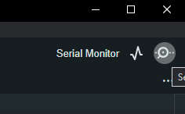
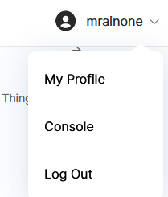
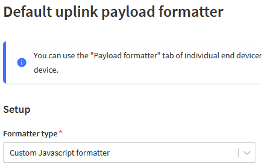
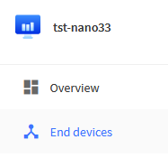
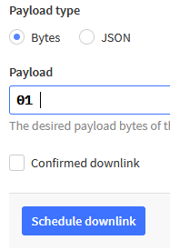
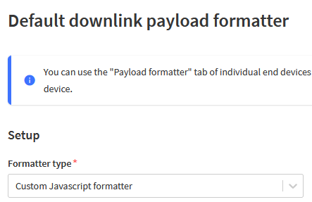

# Uplink and Downlink messages

[TOC]

## Introduction

In LoRaWAN networks, Class A end nodes are low-power IoT devices that can send uplink messages and receive Downlink messages.

To optimize power consumption and enable long-range communication in Class A  devices, Uplink and downlink messages follow a specific pattern:

**Uplink Messages for Class A End Nodes:**

- the End Nodes send asynchronously the Uplink messages
- after the transmission, the end node listens for potential downlink messages during short, specific time windows defined by the network.

**Downlink Messages for Class A End Nodes:**

- The downlink messages may contain commands (such as device configurations or control) or data sent from the server or network to the end node.
- It is not possible to autonomously send downlink messages to Class A end nodes except in response to a previous uplink message.

This tutorial explains how an Arduino sketch works for sending uplink messages to a TTN3 application and receiving commands from the TTN3 application to the node through downlink messages.

## Load the Arduino sketch to the lorawan node


Open sketch: ttn3e5_uplink_count_dwnlink_LEDcolor.ino

Select board:


This is on windows OS,

for MAC and Linux it is slightly different

Upload


compile ...


Select Serial monitor



The program runs, executing these steps:

1. initialization of lorawan parameters
2. loop:
   - send to the TTN3 application an uplink message composed of 5  bytes:
      - bytes 0..3: 32 bit counter incremented each loop
      - byte 4: color code for RGB LED of Nano 33 BLE
         - 0x00: RGB LED OFF
         - 0x01: RGB LED RED
         - 0x02: RGB LED BLUE
         - 0x33: RGB LED GREEN
1. check if there is a downlink message from the TTN application. In this case, set the RGB LED to the color set in the downlink message
2. increment the 32 bit counter
3. Wait 30 seconds
4. repeat loop


Open the things network site

https://www.thethingsnetwork.org/


Select Login


Go down and select Login to The Things Network


After Login, select Console



select “Go to applications”

https://eu1.cloud.thethings.network/console/


https://eu1.cloud.thethings.network/console/applications

In the applications page, select the application where the end node is registered

(in this case, tst-nano33)


On the left menu, select ‘Live data’

https://eu1.cloud.thethings.network/console/applications/tst-nano33/data

this page is updated with the uplink messages sent by the end devices registered in the application


Click on a row of data message to see the details


## Uplink payload formatter

On the left menu, select Payload formatters – Uplink


https://eu1.cloud.thethings.network/console/applications/tst-nano33/payload-formatters/uplink

As ‘Formatter type’ select ‘Custom Javascript formatter’



Insert the downlink formatter to decode the uplink messages sent by the arduino sketch ttn3e5_uplink_count_dwnlink_LEDcolor.ino


### Javascript uplink decoder

```javascript
// uplink decoder ttn v3 for ttn3e5_uplink_count_dwnlink_LEDcolor.ino

var pos = 0;
var bindata = "";

var ConvertBase = function (num) {
    return {
        from : function (baseFrom) {
            return {
                to : function (baseTo) {
                    return parseInt(num, baseFrom).toString(baseTo);
                }
            };
        }
    };
};

function pad(num) {
    var s = "0000000" + num;
    return s.slice(-8);
}

ConvertBase.dec2bin = function (num) {
    return pad(ConvertBase(num).from(10).to(2));
};

ConvertBase.bin2dec = function (num) {
    return ConvertBase(num).from(2).to(10);
};

function data2bits(data) {
    var binary = "";
    for(var i=0; i<data.length; i++) {
        binary += ConvertBase.dec2bin(data[i]);
    }
    return binary;
}

function bitShift(bits) {
    var num = ConvertBase.bin2dec(bindata.substr(pos, bits));
    pos += bits;
    return Number(num);
}

function precisionRound(number, precision) {
  var factor = Math.pow(10, precision);
  return Math.round(number * factor) / factor;
}

function decodeUplink(input) {
	// https://www.thethingsindustries.com/docs/integrations/payload-formatters/javascript/
	var data = {};

	bindata = data2bits(input.bytes);

	counter = bitShift(32);
	rgb_color = bitShift(8);
	rgb_color = rgb_color & 0x03;
	switch(rgb_color) {
		case 0	:							// RGB LED OFF
			RGBcolor = "OFF";
			break;
		case 1	:							// RGB LED RED
			RGBcolor = "RED";
			break;
		case 2	:							// RGB LED BLUE
			RGBcolor = "BLUE";
			break;
		case 3	:							// RGB LED GREEN
			RGBcolor = "GREEN";
			break;
	}
	data.decoded = {
		"counter": counter,
		"RGBcolor": RGBcolor
	};

	return {
		data: data,
		warnings: [],
		errors: []
	};
}
```

Inserted the javascript uplink code, press Save changes


Reopen the Live data page


Now the uplink decoder function is active.

In every uplink message row a decoded field is shown


Click on an uplink message. In ‘Event details’ there is ‘decoded_payload’ json field name with “decoded” that stores two elements:

1. RGBcolor: actual color of Nano 33 LED RGB (in this case: the LED is actually OFF)
2. counter: the actual value of  the counter sent by Nano 33 (in this case: 190)


## Send a downlink message to change RGB LED color

From the left menu select: End devices



https://eu1.cloud.thethings.network/console/applications/tst-nano33/devices

Select the end device registered in the TTN applications


https://eu1.cloud.thethings.network/console/applications/tst-nano33/devices/eui-2cf7f12042004b8a

This will open the General Information tab.


Press the Messaging tab


Select Downlink tab


On Payload type, select ‘Bytes’

Insert the byte code to modify the RGB LED color

| RGB LED                                                      | code | color       |
| ------------------------------------------------------------ | ---- | ----------- |
|  | 0x00 | RGB LED OFF |
|  | 0x01 | RED color   |
|  | 0x02 | BLUE        |
|  | 0x03 | GREEN       |



Press Schedule downlink


After receiving  a new uplink message, the TTN application sends automatically a downlink message to the end node.

The uplink message includes the code that change the color on the RGB LED.


```
AT+CMSGHEX="0000013A01"
+CMSGHEX: ACK Received
+CMSGHEX: PORT: 1; RX: "01"
+CMSGHEX: RXWIN1, RSSI -87, SNR 13.0
+CMSGHEX: Done
+CMSGHEX: Start
+CMSGHEX: Wait ACK
Downlink msg: [01]
rssi:-87
snr :13
RGB LED color: RED
Wait for 30 seconds …
```

## How to create a downlink decoder to send downlink messages in json format

In the  left menu, select Payload formatters – Downlink


As Formatter, select “Custom javascript formatter”



### Javascript downlink formatter

```javascript
// uplink decoder ttn v3 for ttn3e5_uplink_count_dwnlink_LEDcolor.ino
//
// based on LED color example of:
// https://www.thethingsindustries.com/docs/integrations/payload-formatters/javascript/downlink/
//
var colors = ["OFF", "RED", "BLUE", "GREEN"];

function encodeDownlink(input) {
  return {
    bytes: [colors.indexOf(input.data.color)],
    fPort: 1,
  };
}

function decodeDownlink(input) {
  switch (input.fPort) {
  case 1:
    return {
      data: {
        color: colors[input.bytes[0]]
      }
    }
  default:
    return {
      errors: ["unknown FPort"]
    }
  }
}
```

Press Save changes


## Send a downlink message to change RGB LED color using a json payload

From the left menu select: End devices


https://eu1.cloud.thethings.network/console/applications/tst-nano33/devices

Select the end device registered in the TTN applications


https://eu1.cloud.thethings.network/console/applications/tst-nano33/devices/eui-2cf7f12042004b8a

Will open the General Information tab.


Press Messaging tab


Select Downlink tab


On Payload type, select ‘JSON’

in Payload insert:

```
{
  "color": "BLUE"
}
```


Press Schedule downlink


After  receiving a new uplink message, the TTN application sends automatically a downlink message to the end node.

The uplink message includes the code that sets the BLUE color on the RGB LED.

