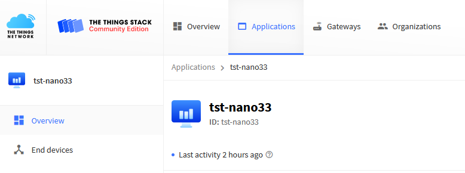
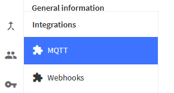
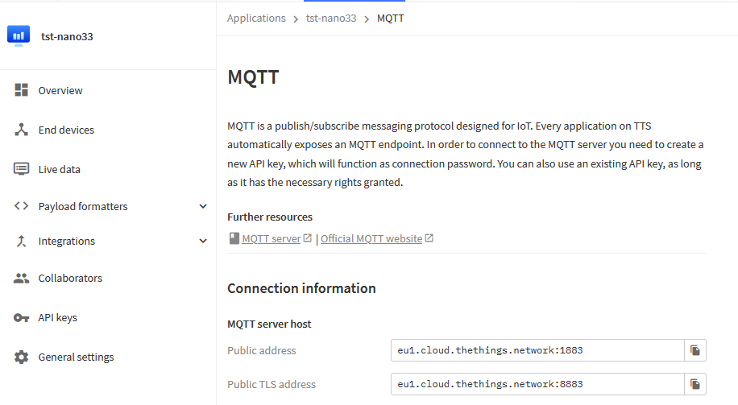

# The Things Network MQTT Integration

To read messages from a TTN3 application using MQTT (Message Queuing Telemetry Transport) from your computer, follow these steps:

1. Access to your TTN3 account through the TTN3 website.
2. Get MQTT credentials: To read messages via MQTT, you will need the MQTT credentials of the TTN3 application. You can find them in the "Integration" section of the TTN3 application. Make sure you have the following information:
   - MQTT Server (usually for Europe).`eu.thethings.network`
   - MQTT Username.
   - MQTT Password.
3. Choose an MQTT client: To connect to TTN3 via MQTT from your laptop, you will need an MQTT client. You can use MQTT clients like Mosquitto, MQTT.fx, or other available MQTT clients.
4. Configure the MQTT client: Configure your MQTT client with the MQTT credentials obtained from the TTN3 application. Make sure to use the correct version of MQTT (TLS) to ensure a secure connection.
5. Subscribe to the relevant MQTT topics: TTN3 uses MQTT topics to publish messages from devices. You need to subscribe to the relevant topics to receive messages from your devices. In general, topics follow a pattern like .`v3/{application_id}/devices/{device_id}/up`
6. Receive and interpret messages: Once successfully connected and subscribed to the topics, your MQTT client will start receiving messages from TTN3 devices. You can then process and interpret the data as per your needs.

Make sure to follow the specific documentation for TTN3 and the MQTT client you are using for further details on how to set up the MQTT connection correctly and read messages from your devices. Questa documentazione illustra l’utilizzo di mosquitto https://mosquitto.org/ per connettersi all’applicazione e leggere dall’Applicazione TTN i messaggi LoraWan in formato json.

## Mosquitto installation

Here are two excellent tutorials that illustrate the installation of mosquitto in various operating environments: https://www.thethingsindustries.com/docs/integrations/mqtt/mqtt-clients/eclipse-mosquitto/ http://www.steves-internet-guide.com/install-mosquitto-broker/

The integration of mqtt into the TTN3 application This page of the TTN website explains the integration operation: https://www.thethingsindustries.com/docs/integrations/adding-integrations/

## Key Generation Example to Enable mqtt Integration

The key generation operation for the mqtt integration only needs to be performed once.

This generates the keys needed to enable access through the mosquitto command

Enter the TTN3 console:

https://eu1.cloud.thethings.network/console/

Enter Applications:

https://eu1.cloud.thethings.network/console/applications

Select the application's web page:

https://eu1.cloud.thethings.network/console/applications/tst-nano33



On the left, under integrations, select: mqtt



https://eu1.cloud.thethings.network/console/applications/tst-nano33/integrations/mqtt



The page with this data opens:

**MQTT**

The Application Server exposes an MQTT server to work with streaming events. 

In order to use the MQTT server you need to create a new API key, which will function as connection password. 

You can also use an existing API key, as long as it has the necessary rights granted. 


Use the connection information below to connect. 

### **Connection credentials**

**Public address**

```
eu1.cloud.thethings.network:1883
```

**Public TLS address**

```
eu1.cloud.thethings.network:8883
```

**Username**

```
tst-nano33@ttn
```

**Password:**

```
xxxxxxxxx
```

When the button **"generate new api key" is pressed, a key similar to this is automatically generated:

```
NNSXS.PMLLGM7CXBKLQ5BYOIEQJAL6QBMNEBTOHS43ZVQ.EXW2XQWJHBPLVEM5KBUDFSKHNQDZCGW37GSNCS4QDNY7GXXFO2FA
```

### Command for mqtt data acquisition via mosquitto_sub

To acquire application data via mqtt through mosquitto, the final command is this:

Linux Command Version:

```
/usr/bin/mosquitto_sub -h eu1.cloud.thethings.network -p 1883 -t  v3/+/devices/+/up -P NNSXS.PMLLGM7CXBKLQ5BYOIEQJAL6QBMNEBTOHS43ZVQ.EXW2XQWJHBPLVEM5KBUDFSKHNQDZCGW37GSNCS4QDNY7GXXFO2FA -u tst-nano33@ttn -C 1
```

Windows 64bit Command Version:

```
"C:\Program Files\mosquitto\mosquitto_sub" -h eu1.cloud.thethings.network -p 1883 -t v3/+/devices/+/up -P NNSXS.PMLLGM7CXBKLQ5BYOIEQJAL6QBMNEBTOHS43ZVQ.EXW2XQWJHBPLVEM5KBUDFSKHNQDZCGW37GSNCS4QDNY7GXXFO2FA -u tst-nano33@ttn -C 1
```

or 32-bit:

```
"C:\Program Files (x86)\mosquitto\mosquitto_sub" -h eu1.cloud.thethings.network -p 1883 -t v3/+/devices/+/up -P NNSXS.PMLLGM7CXBKLQ5BYOIEQJAL6QBMNEBTOHS43ZVQ.EXW2XQWJHBPLVEM5KBUDFSKHNQDZCGW37GSNCS4QDNY7GXXFO2FA -u tst-nano33@ttn -C 1
```

Note:

the "-C 1" option forces the command to capture only one message and then exit at the prompt.

### mqtt Acquisition Example

```
F:\>"C:\Program Files\mosquitto\mosquitto_sub" -h eu1.cloud.thethings.network -p 1883 -t v3/+/devices/+/up -P NNSXS.PMLLGM7CXBKLQ5BYOIEQJAL6QBMNEBTOHS43ZVQ.EXW2XQWJHBPLVEM5KBUDFSKHNQDZCGW37GSNCS4QDNY7GXXFO2FA -u tst-nano33@ttn -C 1
{"end_device_ids":{"device_id":"eui-2cf7f12042004b8a","application_ids":{"application_id":"tst-nano33"},"dev_eui":"2CF7F12042004B8A","join_eui":"8000000000000006","dev_addr":"260B49F5"},"correlation_ids":["gs:uplink:01HDY51CWANACTWC97CWQJDY8N"],"received_at":"2023-10-29T16:42:25.752743083Z","uplink_message":{"session_key_id":"AYt8DxNqUN/c7Y631LMmWg==","f_port":8,"f_cnt":143,"frm_payload":"JzIJRw==","decoded_payload":{"decoded":{"Pressure":100.34,"Temperature":23.75}},"rx_metadata":[{"gateway_ids":{"gateway_id":"eui-58a0cbfffe800efe","eui":"58A0CBFFFE800EFE"},"time":"2023-10-29T16:42:25.494847059Z","timestamp":2847591652,"rssi":-58,"channel_rssi":-58,"snr":9.25,"uplink_token":"CiIKIAoUZXVpLTU4YTBjYmZmZmU4MDBlZmUSCFigy//+gA7+EOSZ680KGgwI8Zb6qQYQ/IfShAIgoLXBjfC0Cg==","received_at":"2023-10-29T16:42:25.494220155Z"}],"settings":{"data_rate":{"lora":{"bandwidth":125000,"spreading_factor":7,"coding_rate":"4/5"}},"frequency":"867700000","timestamp":2847591652,"time":"2023-10-29T16:42:25.494847059Z"},"received_at":"2023-10-29T16:42:25.547559575Z","confirmed":true,"consumed_airtime":"0.051456s","network_ids":{"net_id":"000013","ns_id":"EC656E0000000181","tenant_id":"ttn","cluster_id":"eu1","cluster_address":"eu1.cloud.thethings.network"}}}
```

Example command without -C 1

```
F:\>"C:\Program Files\mosquitto\mosquitto_sub" -h eu1.cloud.thethings.network -p 1883 -t v3/+/devices/+/up -P NNSXS.PMLLGM7CXBKLQ5BYOIEQJAL6QBMNEBTOHS43ZVQ.EXW2XQWJHBPLVEM5KBUDFSKHNQDZCGW37GSNCS4QDNY7GXXFO2FA -u tst-nano33@ttn
{"end_device_ids":{"device_id":"eui-2cf7f12042004b8a","application_ids":{"application_id":"tst-nano33"},"dev_eui":"2CF7F12042004B8A","join_eui":"8000000000000006","dev_addr":"260B49F5"},"correlation_ids":["gs:uplink:01HDY544TGR0WRGNE8EWBN6YK0"],"received_at":"2023-10-29T16:43:55.812105652Z","uplink_message":{"session_key_id":"AYt8DxNqUN/c7Y631LMmWg==","f_port":8,"f_cnt":146,"frm_payload":"JzIJSg==","decoded_payload":{"decoded":{"Pressure":100.34,"Temperature":23.78}},"rx_metadata":[{"gateway_ids":{"gateway_id":"eui-58a0cbfffe800efe","eui":"58A0CBFFFE800EFE"},"time":"2023-10-29T16:43:55.548470020Z","timestamp":2937646259,"rssi":-65,"channel_rssi":-65,"snr":9.5,"uplink_token":"CiIKIAoUZXVpLTU4YTBjYmZmZmU4MDBlZmUSCFigy//+gA7+ELPZ4/gKGgwIy5f6qQYQzbW6ngIguLbyyr+3Cg==","received_at":"2023-10-29T16:43:55.548358732Z"}],"settings":{"data_rate":{"lora":{"bandwidth":125000,"spreading_factor":7,"coding_rate":"4/5"}},"frequency":"868100000","timestamp":2937646259,"time":"2023-10-29T16:43:55.548470020Z"},"received_at":"2023-10-29T16:43:55.601657658Z","confirmed":true,"consumed_airtime":"0.051456s","network_ids":{"net_id":"000013","ns_id":"EC656E0000000181","tenant_id":"ttn","cluster_id":"eu1","cluster_address":"eu1.cloud.thethings.network"}}}
{"end_device_ids":{"device_id":"eui-2cf7f12042004b8a","application_ids":{"application_id":"tst-nano33"},"dev_eui":"2CF7F12042004B8A","join_eui":"8000000000000006","dev_addr":"260B49F5"},"correlation_ids":["gs:uplink:01HDY5524AK0G6JRVJ0DK8X1HY"],"received_at":"2023-10-29T16:44:25.815267175Z","uplink_message":{"session_key_id":"AYt8DxNqUN/c7Y631LMmWg==","f_port":8,"f_cnt":147,"frm_payload":"JzIJSA==","decoded_payload":{"decoded":{"Pressure":100.34,"Temperature":23.76}},"rx_metadata":[{"gateway_ids":{"gateway_id":"eui-58a0cbfffe800efe","eui":"58A0CBFFFE800EFE"},"time":"2023-10-29T16:44:25.558506011Z","timestamp":2967664108,"rssi":-66,"channel_rssi":-66,"snr":9.25,"uplink_token":"CiIKIAoUZXVpLTU4YTBjYmZmZmU4MDBlZmUSCFigy//+gA7+EOzri4cLGgwI6Zf6qQYQ7LuDowIg4MPCtK+4Cg==","received_at":"2023-10-29T16:44:25.557944171Z"}],"settings":{"data_rate":{"lora":{"bandwidth":125000,"spreading_factor":7,"coding_rate":"4/5"}},"frequency":"867900000","timestamp":2967664108,"time":"2023-10-29T16:44:25.558506011Z"},"received_at":"2023-10-29T16:44:25.611189804Z","confirmed":true,"consumed_airtime":"0.051456s","network_ids":{"net_id":"000013","ns_id":"EC656E0000000181","tenant_id":"ttn","cluster_id":"eu1","cluster_address":"eu1.cloud.thethings.network"}}}xxxxxxxxxx3 1F:\>"C:\Program Files\mosquitto\mosquitto_sub" -h eu1.cloud.thethings.network -p 1883 -t v3/+/devices/+/up -P NNSXS.PMLLGM7CXBKLQ5BYOIEQJAL6QBMNEBTOHS43ZVQ.EXW2XQWJHBPLVEM5KBUDFSKHNQDZCGW37GSNCS4QDNY7GXXFO2FA -u tst-nano33@ttn2{"end_device_ids":{"device_id":"eui-2cf7f12042004b8a","application_ids":{"application_id":"tst-nano33"},"dev_eui":"2CF7F12042004B8A","join_eui":"8000000000000006","dev_addr":"260B49F5"},"correlation_ids":["gs:uplink:01HDY544TGR0WRGNE8EWBN6YK0"],"received_at":"2023-10-29T16:43:55.812105652Z","uplink_message":{"session_key_id":"AYt8DxNqUN/c7Y631LMmWg==","f_port":8,"f_cnt":146,"frm_payload":"JzIJSg==","decoded_payload":{"decoded":{"Pressure":100.34,"Temperature":23.78}},"rx_metadata":[{"gateway_ids":{"gateway_id":"eui-58a0cbfffe800efe","eui":"58A0CBFFFE800EFE"},"time":"2023-10-29T16:43:55.548470020Z","timestamp":2937646259,"rssi":-65,"channel_rssi":-65,"snr":9.5,"uplink_token":"CiIKIAoUZXVpLTU4YTBjYmZmZmU4MDBlZmUSCFigy//+gA7+ELPZ4/gKGgwIy5f6qQYQzbW6ngIguLbyyr+3Cg==","received_at":"2023-10-29T16:43:55.548358732Z"}],"settings":{"data_rate":{"lora":{"bandwidth":125000,"spreading_factor":7,"coding_rate":"4/5"}},"frequency":"868100000","timestamp":2937646259,"time":"2023-10-29T16:43:55.548470020Z"},"received_at":"2023-10-29T16:43:55.601657658Z","confirmed":true,"consumed_airtime":"0.051456s","network_ids":{"net_id":"000013","ns_id":"EC656E0000000181","tenant_id":"ttn","cluster_id":"eu1","cluster_address":"eu1.cloud.thethings.network"}}}3{"end_device_ids":{"device_id":"eui-2cf7f12042004b8a","application_ids":{"application_id":"tst-nano33"},"dev_eui":"2CF7F12042004B8A","join_eui":"8000000000000006","dev_addr":"260B49F5"},"correlation_ids":["gs:uplink:01HDY5524AK0G6JRVJ0DK8X1HY"],"received_at":"2023-10-29T16:44:25.815267175Z","uplink_message":{"session_key_id":"AYt8DxNqUN/c7Y631LMmWg==","f_port":8,"f_cnt":147,"frm_payload":"JzIJSA==","decoded_payload":{"decoded":{"Pressure":100.34,"Temperature":23.76}},"rx_metadata":[{"gateway_ids":{"gateway_id":"eui-58a0cbfffe800efe","eui":"58A0CBFFFE800EFE"},"time":"2023-10-29T16:44:25.558506011Z","timestamp":2967664108,"rssi":-66,"channel_rssi":-66,"snr":9.25,"uplink_token":"CiIKIAoUZXVpLTU4YTBjYmZmZmU4MDBlZmUSCFigy//+gA7+EOzri4cLGgwI6Zf6qQYQ7LuDowIg4MPCtK+4Cg==","received_at":"2023-10-29T16:44:25.557944171Z"}],"settings":{"data_rate":{"lora":{"bandwidth":125000,"spreading_factor":7,"coding_rate":"4/5"}},"frequency":"867900000","timestamp":2967664108,"time":"2023-10-29T16:44:25.558506011Z"},"received_at":"2023-10-29T16:44:25.611189804Z","confirmed":true,"consumed_airtime":"0.051456s","network_ids":{"net_id":"000013","ns_id":"EC656E0000000181","tenant_id":"ttn","cluster_id":"eu1","cluster_address":"eu1.cloud.thethings.network"}}}
```